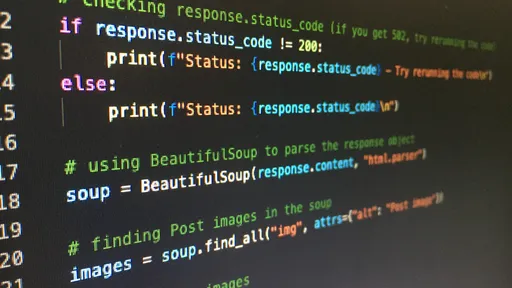

# PersonalCheff
<!---Esses são exemplos. Veja https://shields.io para outras pessoas ou para personalizar este conjunto de escudos. Você pode querer incluir dependências, status do projeto e informações de licença aqui--->



> Uma aplicação web de receitas chamada PersonalCheff desenvolvida durante o curso de Python no Senac Americana. A aplicação listará receitas e clicando em cada nome de receita você pode ver a receita completa.

### Lista de tarefas
Segue a lista de tarefas a serem desenvolvidas no projeto:
- [X] Pré-requisitos
    - [X] Instalar o Python
    - [X] Instalar Visual Studio Code
- [X] Criar e ativar o ambiente virtual
```
python -m venv .\venv\
venv\Scripts\activate
# se der erro no powershell utilize o comando abaixo para resolver a permissão
# Set-ExecutionPolicy -ExecutionPolicy RemoteSigned -Scope CurrentUser
```
- [X] Instalar o Django
```
python -m pip install django==3.2
```
- [X] Criar o projeto PersonalCheff
```
django-admin.py startproject PersonalCheffProject PersonalCheffProj
```
- [X] Subir o servidor e testar o projeto
```
entrar na pasta do projeto
cd PersonalCheffProj

executar o projeto no servidor
python manage.py runserver
```
- [X] Alterar o idioma do projeto para `pt-br`
    - Abrir o arquivo `settings.py` e na linha 106 trocar `en-us` para `pt-br`
- [X] Alterar o timezone do projeto para `America/Sao_Paulo`
- [X] Criar o app receitas
```
* preciso estar dentro da pasta do projeto (PersonalcheffProj)
python manage.py startapp receitas
```
- [X] Registrar o app receitas
```
no arquivo settings.py adicionar o app receitas na lista de apps 
INSTALLED_APPS[
    ...
    'receitas',
]
```
- [X] Configurar a rota inicial(index)
    - Dentro da pasta receita(app) criar o arquivo `urls.py`
    - no arquivo `urls.py` 
        ```python
            from django.urls import path
            from . import views

            urlpatterns = [
                path('', views.index, name='index')
            ]
        ```
- [X] Criar a view para a rota inicial
    - Dentro da pasta receitas(app) abrir o arquivo `views.py` 
    ```python
        from django.shortcuts import render
        from django.http import HttpResponse

        def index(request):
            return HttpResponse("<h1>Seja bem vindo</h1>")
    ```
- [X] Registrar a rota inicial
    - Dentro da pasta PersonalCheffProj(app) abrir o arquivo `urls.py`
    ```python
    from django.contrib import admin
    from django.urls import path, include

    urlpatterns = [
        path('admin/', admin.site.urls),
        path('',include('receitas.urls')),
    ]
    ```
- [X] Criar o arquivo index.html
    - Dentro da pasta receitas(app), crie a pasta `templates`
    - Dentro da pasta `templates`crie seus arquivos HTML começando pelo `index.html`
    - No arquivo `views.py` que está dentro da pasta do app faça a seguinte alteração de código: 
    ```python
    from django.shortcuts import render

    def index(request):
        return render(request,'index.html')
    ```
- [X] Integrar arquivos estáticos (CSS, JS, IMG)
    - Dentro da pasta do projeto (PersonalCheffProj), criar a pasta `static`
    - Dentro da pasta `static`, colocar as imagens, os arquivos css e os arquivos js que for utilizar
    - No arquivo `settings.py`: 
        - realize a importação da biblioteca `os` através do comando `import os` 
        - na linha ~58 adicione o caminho dos templates da seguinte forma:
        ```python
        'DIRS': [os.path.join(BASE_DIR, 'receitas/templates')],
        ```
        - no final do arquivo, após a linha `STATIC_URL` insira o seguinte código:
        ```python
        STATIC_ROOT = os.path.join(BASE_DIR, 'static')
        STATICFILES_DIRS = [
            os.path.join(BASE_DIR, 'PersonalCheffProj/static')
        ]
        ```
        - `STATIC_URL`: é a configuração da rota através do qual os arquivos estáticos seram servidos
        - `STATIC_ROOT`: configuração da pasta de saída(destino) dos arquivos estáticos
        - `STATICFILES_DIRS`: cofiguração da(s) pasta de origem dos arquivos estáticos.
        - após realizar essas configurações execute, no terminal, o comando `python manage.py collectstatic`
        - na primeira linha do arquivo `index.html` insira ``. Esse comando deve ser usado em todos os arquivos em que você for utilizar arquivos estáticos.
        - insira uma imagem utilizando o comando ``. Sempre que for utilizar um arquivo estático você deve utilizar ``
- [X] Utilizando links
    - para criar um link para a página index, independente de onde você esteja utilize o comando `url`:
        ```python
        <a href="">Página inicial</a>
        ```
- [X] Criando o base.html
    - na pasta `templates`crie o arquivo `base.html`. Esse arquivo contém todo o código de estrutura comum à todas as páginas. Nesse arquivo deve ficar tudo que tiver antes do `body` e tudo que tiver depois do `/body`.
    - nesse arquivo deve conter o ``
    - nesse arquivo, no local aonde será carregado o conteúdo das outras páginas, deve existir os delimitadores `` e ``
    - o código do `base.html` será algo parecido com:
        ```python
        
        <!DOCTYPE html>
        <html lang="pt-br">
        <head>
            <meta charset="UTF-8">
            <meta http-equiv="X-UA-Compatible" content="IE=edge">
            <meta name="viewport" content="width=device-width, initial-scale=1.0">
            <title>PersonalCheff</title>
            <link rel="stylesheet" href="">
            <link rel="shortcut icon" href="" type="image/x-icon">
        </head>
        <body>
        
        
        
        </body>
        </html>
        ```
- [X] Separando em partials
    - criar uma pasta chamada `partials` dentro da pasta `templates`
    - dentro da pasta `partials`crie os arquivos que serão as **partes globais** utilizadas no seu projeto como `header.html`, `footer.html`, `menu.html`, `side-bar.html`, `banner.html`, etc. No nosso exemplo criamos as partials `header.html` e `footer.html`
    - insira em cada um dos arquivos partials seus códigos correspondentes. Exemplo:  no arquivo `header.html` eu insiro todo o conteúdo que eu quero que seja apresentado no cabeçalho da minha aplicação. Não se esqueça do comando ``.
    - para incluir as partials nos arquivos de destino utilize o comando `include` da seguinte maneira: ``
- [X] Renderizando dados dinamicamente
    - Trocar as informações fixas no arquivo html por informações dinâmicas vindas do arquivo python. 
    - Quero gerar a lista de receitas de foram dinâmica, vamos fazer isso utilizando o recurso do Django que passa uma informação para minhas templates(.html) através da passagem de uma parâmetro no comando `render` que está em minha view(.py):
        ```python
        return render(request,'index.html', {'nome_da_receita':'suco de laranja'})
        ```
    - Observer que passei através do comando `render` um `dicionário` para a template. Na minha template(`index.html`) eu posso exibir o conteúdo desse dicionário da seguinte forma:
        ```python
        <td>
            {{nome_da_receita}}</td>
        ```
    - Vale a pena diferenciar o uso de `{{ }}` e ``:
        - `{{ }}` é utilizado normalmente para exibir o valor de variáveis, para mostrar informação em tela
        - `` é utilizado para o processamento de informações, usamos esses delimitadores quando precisamos de `if` ou `for`por exemplo.
- [X] Criando um dicionario com as receitas
    - No arquivo `views.py` vamos criar um dicionário com as receitas, modifique a função `index` da seguinte forma:
        ```python
        def index(request):
            receitas = {
                1:'Suco de Melão',
                2:'Pizza',
                3:'Suco de Limão',
            }
            
            dados = {
                'lista_receitas' : receitas
            }
            
            return render(request,'index.html', dados)
        ```
    - na template `index.html`, eu faço um laço de repetição que verifique cada item da lista de receitas à cada passagem do laço:
        ```python
        
            <tr>
                <td>
                    
                    {{uma_receita}}
                </td>
                <td>https://www.youtube.com/watch?v=Nn9140bDPnc</td>
                <td><a href="" class="btn btn-info">Ver receita completa</a></td>
            </tr>
        
        ```
- [X] Criando o banco de dados(MySQL/MariaDB)
    - Abra o XAMPP e start os serviços do Apache e MySQL
    - Click no botão admin do Apache
    - Acesse o link PHPMyAdmin
    - Dentro do PHPMyAdmin, click no botão `novo` para criar um banco de dados, insira o nome `personalcheff_bd`
- [X] Instalando o conector do bando de dados MySQL
    - `pip install mysqlclient` se der acesso negado tente `python -m pip install mysqlclient` 
- [X] Configurar a conexão com mysql
    - No arquivo `settings.py` , na linha ~78 configurar a conexão para o seu banco de dados como no exemplo
        ```python
            'default': {
                'ENGINE': 'django.db.backends.mysql',
                'NAME': 'personalcheff_bd',
                'USER': 'root',
                'PASSWORD': '',
                'HOST': 'localhost',
                'PORT': '3306',
            }
        ```
- [X] Criando o modelo da receita
    - Modelo é a representação das tabelas no banco de dados. Cada classe em uma model equivale a uma tabela. 
    - No arquivo `receitas\models.py` crie a classe para a respresentação da tabela de receitas:
        ```python
        from django.db import models
        from datetime import datetime

        class Receitas(models.Model):
            nome_receita = models.CharField(max_length=100)
            video = models.CharField(max_length=80)
            modo_preparo = models.TextField()
            ingredientes = models.TextField()
            nota = models.IntegerField()
            data_receita = models.DateTimeField(default=datetime.now, blank=True)
        ```
- [X] Criando a migration (mapeamento)
    - preparar todas as models criadas para serem migradas para o banco de dados
    - no terminal digite `python manage.py makemigrations` 
- [X] Realizando a migration
    - Realizar a migração é criar fisicamente no banco de dados as tabelas preparadas anteriormente, e, no nosso caso, as tabelas prepradas pelo django para o seu ambiente administrativo
    - No terminal digite `python manage.py migrate`
- [x] Criando um usuário para o ambiente administrativo
    - O DJANGO já cria um ambiente administrativo para nossa aplicação, ficando esse ambiente em: `http://127.0.0.1:8000/admin/`
    - Para utilizar o ambiente administrativo precisamos criar um usuário de acesso. No terminal digite        `python manage.py createsuperuser`
    - ***Obs: Quando digitar a senha, ela vai ficar em branco
- [ ] Registrando um modelo no admin

## 📝 Licença
Esse projeto está sob licença. Veja o arquivo [LICENÇA](LICENSE.md) para mais detalhes.
[⬆ Voltar ao topo](#nome-do-projeto)<br>